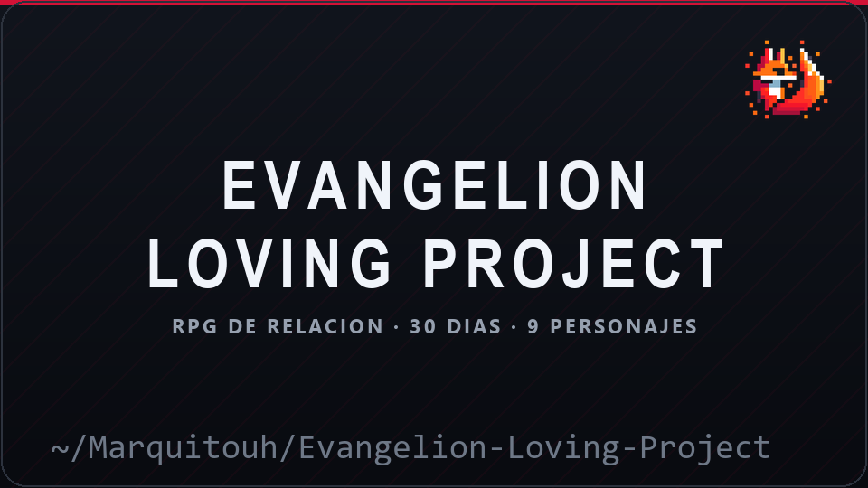
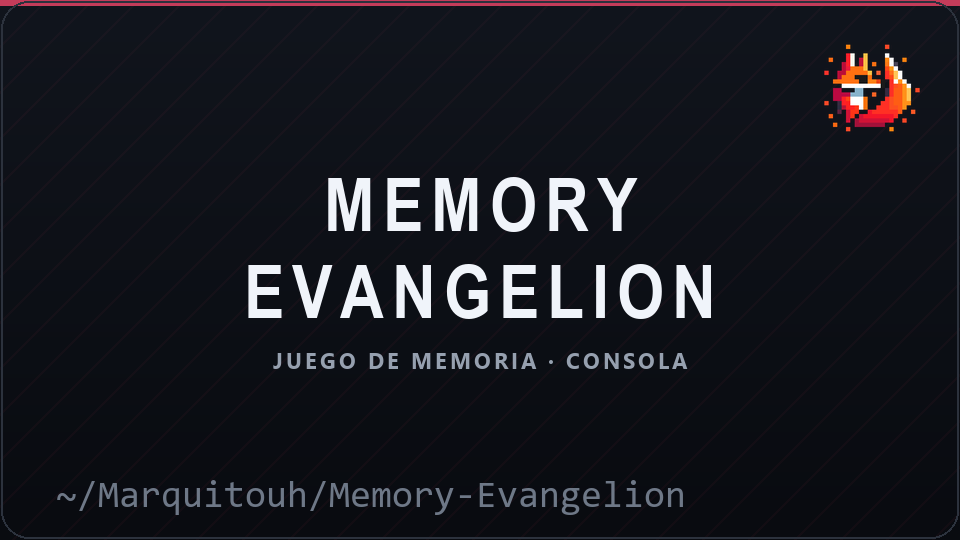
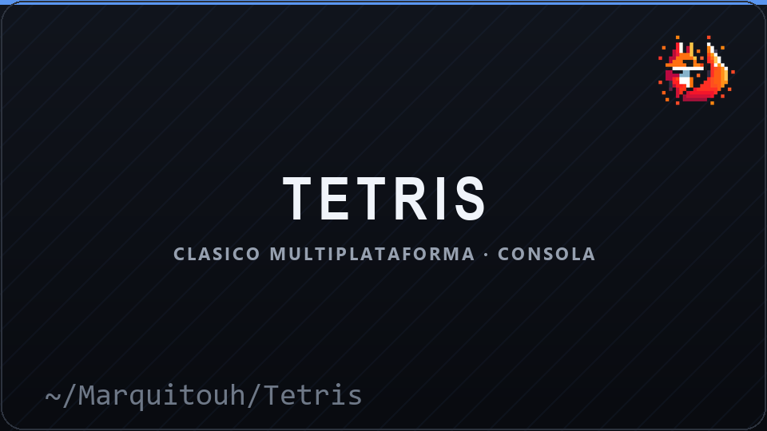
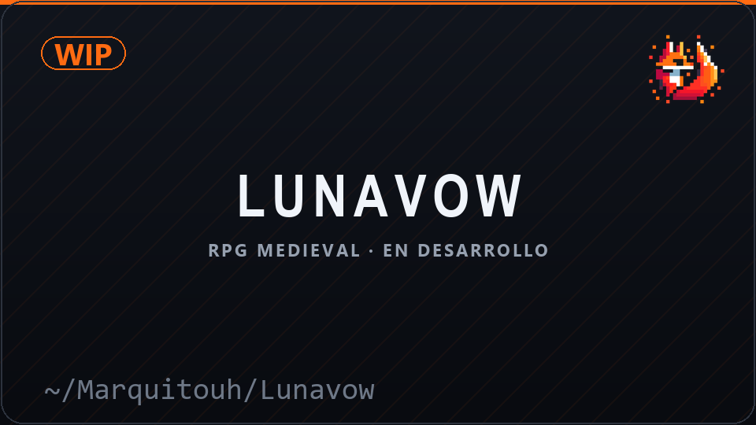
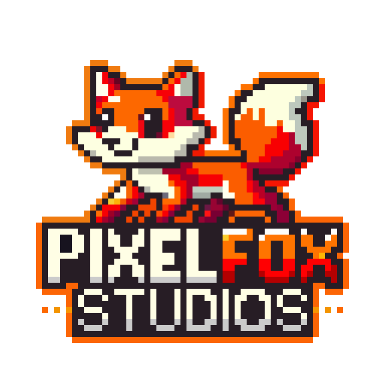
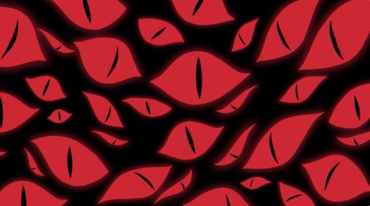

<!--
  README de perfil de GitHub · Marquitouh
  ────────────────────────────────────────────────────────────
  · El arte ASCII del encabezado se inyecta desde assets/ascii/<fuente>.txt
    con tools/build_readme.py (asi se puede cambiar de fuente sin tocar aca).
  · Las portadas de la seccion "Proyectos" se regeneran con
    python tools/generate_covers.py
  · Todo el HTML es el que GitHub permite en un README (div, table, picture,
    details, a, img). No hay <style> ni JavaScript: GitHub los borra.
  · Al cambiar de tema en GitHub, el ASCII y las portadas se ven igual en
    claro y en oscuro porque no dependen del color de texto.
-->

<pre>
███╗   ███╗ █████╗ ██████╗  ██████╗ ██╗   ██╗██╗████████╗ ██████╗ ██╗   ██╗██╗  ██╗
████╗ ████║██╔══██╗██╔══██╗██╔═══██╗██║   ██║██║╚══██╔══╝██╔═══██╗██║   ██║██║  ██║
██╔████╔██║███████║██████╔╝██║   ██║██║   ██║██║   ██║   ██║   ██║██║   ██║███████║
██║╚██╔╝██║██╔══██║██╔══██╗██║▄▄ ██║██║   ██║██║   ██║   ██║   ██║██║   ██║██╔══██║
██║ ╚═╝ ██║██║  ██║██║  ██║╚██████╔╝╚██████╔╝██║   ██║   ╚██████╔╝╚██████╔╝██║  ██║
╚═╝     ╚═╝╚═╝  ╚═╝╚═╝  ╚═╝ ╚══▀▀═╝  ╚═════╝ ╚═╝   ╚═╝    ╚═════╝  ╚═════╝ ╚═╝  ╚═╝
                                                                                   
</pre>

### Desarrollador de software y videojuegos · CEO de <b>PixelFox Studios</b>

Diseño de sistemas, herramientas internas y experiencias interactivas. 
Simuladores, lógica algorítmica y la consola como lienzo, con nada más que <code>C</code>.

  

 

## 🧠 Sobre mí

Soy **Marquitouh** y programo desde Argentina. Empecé con juegos de consola escritos a mano en **C** —Tetris, Memory y un RPG de relaciones con los personajes de *Evangelion*— y de ahí me quedó la obsesión: que todo sea simple, portable y que se sienta bien en la pantalla.

Hoy estoy al frente de **PixelFox Studios**, donde me dedico al diseño de sistemas, las herramientas internas y las experiencias interactivas. Me gustan los proyectos donde la limitación técnica es el motor del diseño, no un obstáculo: hacer que un juego de consola en C tenga ritmo, que una herramienta sea realmente usable y que el código se pueda entender seis meses después.

Fuera del código, los videojuegos y el anime son parte del método. Casi todo lo que hago arranca con una pregunta narrativa y termina siendo un problema de lógica.

## 🕹️ Proyectos

<table>
  <tr>
    <td width="50%" valign="top">
      
       Misiones diarias, afinidad con 9 personajes, logros y partida guardada. 
      <code>641 líneas de C</code>
    </td>
    <td width="50%" valign="top">
      
       El clásico de memoria por turnos, dibujado en consola. 
      <code>C</code>
    </td>
  </tr>
  <tr>
    <td width="50%" valign="top">
      
       Tablero 10×20, 7 piezas clásicas y controles WASD. 
      <code>Windows y POSIX en el mismo código</code>
    </td>
    <td width="50%" valign="top">
      
       RPG medieval con personajes antropomórficos y narrativa emocional. 
      <code>En desarrollo · sin repo público todavía</code>
    </td>
  </tr>
</table>

## 🦊 PixelFox Studios

  

**PixelFox Studios** es el estudio del que salen los juegos en C, el sitio web y este mismo perfil. Ahí se cocina todo: prototipos, utilidades internas y las experiencias interactivas que después se convierten en proyecto.

Me interesa especialmente el lado de las herramientas: scripts, automatizaciones y sistemas chicos que le ahorran horas a quien los usa.

## 🌐 Mi sitio

  
   
  <a href="https://marquitouh.github.io"><b>marquitouh.github.io</b></a> — proyectos, juegos y todo lo demás que se me ocurre.

## 📊 GitHub

   

## 🛠️ Tecnologías

**Lenguajes** — )  

**Áreas** —    

**Herramientas** —    

## 📫 Contacto

   

  🟢 Abierto a colaboraciones y proyectos.

> *"La creatividad nace cuando las limitaciones técnicas se transforman en oportunidades narrativas."*

