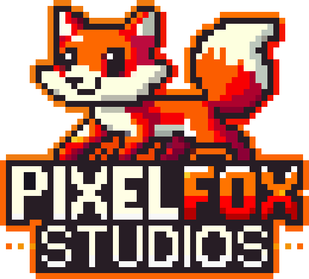

<!--
  README de perfil de GitHub · Marquitouh
  ────────────────────────────────────────────────────────────
  · El arte ASCII del encabezado viene de assets/ascii/<fuente>.txt y se
    inyecta con:  python tools/build_readme.py --font doom
  · Estilo monocromo y sobrio (sin <style> ni JS: GitHub los borra).
  · Cada imagen que cambia con el tema va duplicada con los fragmentos
    #gh-dark-mode-only y #gh-light-mode-only: asi cada tema ve la suya.
  · Servicios externos usados (ver PUSH.md): github-readme-stats, streak-stats,
    skillicons.dev y activity-graph. Si uno se cae, solo se ve esa seccion vacia.
-->

<pre align="center">
___  ___  ___  ______ _____ _   _ _____ _____ _____ _   _ _   _
|  \/  | / _ \ | ___ \  _  | | | |_   _|_   _|  _  | | | | | | |
| .  . |/ /_\ \| |_/ / | | | | | | | |   | | | | | | | | | |_| |
| |\/| ||  _  ||    /| | | | | | | | |   | | | | | | | | |  _  |
| |  | || | | || |\ \\ \/' / |_| |_| |_  | | \ \_/ / |_| | | | |
\_|  |_/\_| |_/\_| \_|\_/\_\\___/ \___/  \_/  \___/ \___/\_| |_/
</pre>

**software y videojuegos**

Desarrollador en `C` · CEO de **PixelFox Studios** · Argentina

  

 

  

## 🧠 Sobre mí

  

 

Programo desde Argentina y mi obsesión es la consola: gráficos, entrada, sonido
y lógica escritos a mano en **C**, sin motor y sin atajos.

Empecé con **Tetris**, **Memory** y un RPG de relaciones con los personajes de
*Evangelion*, y de ahí me quedó la obsesión: que todo sea simple, portable y que
se sienta bien en la pantalla. No me interesa el gráfico que no se pueda explicar
en una línea de comentario.

Hoy estoy al frente de **PixelFox Studios**, dedicándome al diseño de sistemas,
las herramientas internas y las experiencias interactivas. Me gustan los
proyectos donde la limitación técnica es el motor del diseño y no un obstáculo:
que un juego de consola tenga ritmo, que una herramienta sea usable de verdad y
que el código se pueda entender seis meses después.

Fuera del código, los videojuegos y el anime son parte del método. Casi todo lo
que hago arranca con una pregunta narrativa y termina siendo un problema de
lógica.

## 🦊 PixelFox Studios

**PixelFox Studios** es el estudio del que salen los juegos en C, el sitio web y
este mismo perfil. Ahí se cocina todo: prototipos, utilidades internas y las
experiencias interactivas que después se convierten en proyecto.

Me interesa especialmente el lado de las herramientas: scripts, automatizaciones
y sistemas chicos que le ahorran horas a quien los usa.

  
   
  <a href="https://marquitouh.github.io"><b>marquitouh.github.io</b></a> — juegos, proyectos y todo lo demás que se me ocurre.

## 🛠️ Stack

  

  

**Lenguajes** — C · Python · JavaScript

**Áreas** — Motores de consola · Simuladores · Lógica algorítmica

**Herramientas** — GCC · CMake · Git · GitHub · Linux · VS Code

## 📊 GitHub

&nbsp;

 

&nbsp;

 

 

## 📈 Actividad

  
  

 

  

## 🤝 Conectar

  

  

🟢 Abierto a colaboraciones, proyectos y temas de C.

 

> *"La creatividad nace cuando las limitaciones técnicas se transforman en oportunidades narrativas."*

